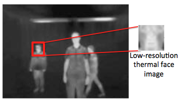
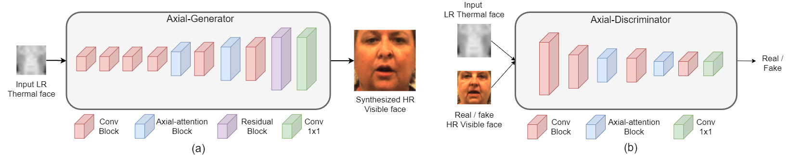

# Axial-GAN

Code for the paper: [Simultaneous Face Hallucination and Translation for Thermal to Visible Face Verification using Axial-GAN](https://arxiv.org/abs/2104.06534)

## Introduction

Existing thermal-to-visible face verification approaches expect the thermal and visible face images to be of similar resolution.
This is unlikely in real-world long-range surveillance systems since humans are distant from the cameras. To address this issue,
we introduce the task of thermal-to-visible face verification  from  low-resolution  thermal  images. Furthermore, we  propose 
Axial-Generative Adversarial Network (Axial-GAN) to synthesize high-resolution visible images for matching. In the proposed approach
we augment the GAN framework with axial-attention layers which leverage the recent advances in transformers for modelling long-range 
dependencies.

<p align="center">
  
</p>



## Requirements
- Python 3.7.9
- PyTorch 1.4.0
- Tensorboard 1.15.0
- Install all the dependencies using conda:  `conda env create -f environment.yml`.

## Usage

### Datasets

- Dataloader for [ARL-VTF dataset](https://openaccess.thecvf.com/content/WACV2021/html/Poster_A_Large-Scale_Time-Synchronized_Visible_and_Thermal_Face_Dataset_WACV_2021_paper.html): `data/aligned_arl_dataset.py`
- Dataloader for [Extended ARL polarimetric thermal dataset](https://ieeexplore.ieee.org/document/9358101) : `data/aligned_arl3_dataset.py`

**Note**: The dataloaders are not similar to pix2pix dataloader (`data/aligned_dataset.py`)

### VGG-Face

- We need VGG-Face pre-trained model for monitoring during validation and also for computing face verification results.
  Follow the described steps in [PyVGGFace](https://github.com/chi0tzp/PyVGGFace) and save `vggface.pth` in `checkpoints` dir.

### Training and Testing
- Train a model:
```bash
python val.py --dataroot ../../datasets/Odin3 --name 001_axial_arl --model pix2pix_conf --dataset_mode aligned_arl
```
- Training results and loss plots can be viewed in tensorboard. Run `tensorboard --logdir checkpoints`
- Test the model by computing image quality metrics (PSNR and SSIM):
```bash
python test_metrics.py --dataroot ../../datasets/Odin3 --name 001_axial_arl --model pix2pix_conf --dataset_mode aligned_arl
```
- For computing both verification and image quality metrics run `face_verf_arl.ipynb` and `face_verf_arl3.ipynb` notebooks for
ARL-VTF dataset and extended ARL polarimetric dataset, respectively.
- `test_arl3.py` can also be used for computing testing metrics for the extended ARL polarimetric dataset.

### Miscellaneous
- `misc/create_arl3_split.ipynb` can be used for creating splits for extended ARL polatimeteric dataset.
- `generate_bicubic_img.m` can be used for generating LR and upsampled LR images.

### [Code structure](docs/overview.md)
- The code is built upon [pix2pix](https://github.com/junyanz/pytorch-CycleGAN-and-pix2pix). For understanding the code, 
  please directly refer to their repository.

## Citation
```
@article{immidisetti2021simultaneous,
  title={Simultaneous Face Hallucination and Translation for Thermal to Visible Face Verification using Axial-GAN},
  author={Rakhil Immidisetti and Shuowen Hu and Vishal M. Patel},
  journal={arXiv preprint arXiv:2104.06534},
  year={2021}
}
```

## Acknowledgments
- Our code is built on top of [pix2pix](https://github.com/junyanz/pytorch-CycleGAN-and-pix2pix).
- Some components have been taken from
  [Axial-DeepLab](https://github.com/csrhddlam/axial-deeplab),
  [pix2pixHD](https://github.com/NVIDIA/pix2pixHD), 
  [SPADE](https://github.com/NVlabs/SPADE), 
  [HiFaceGAN](https://github.com/Lotayou/Face-Renovation), 
  [BasicSR](https://github.com/xinntao/BasicSR), 
  and [PyVGGFace](https://github.com/chi0tzp/PyVGGFace) 
- Additionally, thanks to [Xing Di](https://scholar.google.com/citations?user=2KNy5XIAAAAJ&hl=en) for providing basic face
  verification and preprocessing scripts. 
